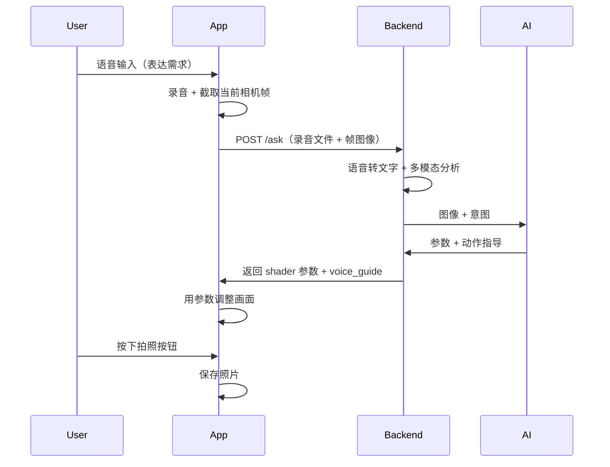

# 相机导演 App 简化流程：分析与实现计划

## 一、你描述的流程（目标）

- **入口**：用户说一句话（语音）表达需求，不再单独输入文字意图。
- **一次请求**：App 把「录音 + 当前帧」发给后端一个接口（如 `/ask`），后端 AI 分析后直接返回参数和动作指导。
- **终点**：用返回参数更新预览，用户满意后按拍照保存。

---

## 二、优缺点分析

### 优点

| 点    | 说明                                     |
| ---- | -------------------------------------- |
| 流程短  | 一次「说 → 看效果 → 拍」，无需先输文字再等周期抽帧。          |
| 意图自然 | 语音更适合「导演」场景（“往左一点”“要赛博朋克一点”）。          |
| 接口单一 | 一个 `/ask` 统一收「语音+画面」，后端统一做 STT + 视觉理解。 |
| 终点清晰 | 参数到位后用户主动按拍照，心智简单。                     |

### 缺点与风险

| 点       | 说明                                              |
| ------- | ----------------------------------------------- |
| 首轮不准需重说 | 若 AI 理解偏了或参数不对，只能再录一段，没有原「Director Loop」的连续微调。  |
| 上传体积与延迟 | 录音（如 10s）+ 一帧图，需限制时长和分辨率，否则首包和首响会变慢。            |
| 后端需处理音频 | 要接 STT（语音转文字），再走现有「图像+文本」多模态；或上能听音频的多模态模型（少且贵）。 |
| 弱网体验    | 一次请求包含音频+图，对网络要求比纯文字高。                          |

---

## 三、流程改善建议

1. **保留「文字意图」作为兜底**
  在 App 上提供「语音为主、可切文字」：语音失败、识别为空或用户偏好时，可手动输入一句意图，仍用同一套「图像+意图」分析逻辑，接口可复用 `/ask`（意图来自语音转写或文字框）。
2. **限制录音时长**
  建议单次最长 10–15 秒并明确提示，既控制上传大小，又避免过长描述导致意图分散；后端可对超长音频截断或拒绝。
3. **后端先 STT 再多模态**
  采用「录音 → STT → 文本意图 + 图像 → 现有 CharaBoard 多模态」：不改 CharaBoard 调用方式，只在 `/ask` 前增加一步 STT（如 Whisper 或云 STT），把 `intent` 从语音里析出，再调用现有 `analyze_frame(image_base64, intent)`。
4. **参数应用加过渡**
  收到 `/ask` 返回后，用 300–500ms Lerp 把当前 shader 参数过渡到目标值，避免画面突变，体验更顺。
5. **拍照前可微调**
  在「参数已应用」到「用户按拍照」之间，允许用户继续用现有滑块微调（可选），再拍照，兼顾「一键出片」和「微调党」。
6. **/ask 与 /api/analyze 的关系**
  两种方案二选一或并存：  
  - **方案 A**：只做 `/ask`，请求体里同时支持「录音文件」和「意图文本」二选一或都有（有文本则跳过 STT）；  
  - **方案 B**：保留现有 `POST /api/analyze`（图+文本），新增 `POST /ask`（图+录音，内部 STT 后转调 analyze）。  
   推荐方案 B，兼容现有脚本和调试，新流程走 `/ask`。

---

## 四、实现计划（可落地）

### 4.1 后端：新增 `/ask` 与 STT

- **新端点** `POST /ask`：接收 `multipart/form-data` 或 JSON（录音 base64 + 图像 base64）；可选字段 `intent` 文本，若存在则不再做 STT。
- **STT**：用 Whisper（本地或 API）或云厂商 STT 将录音转成 `intent` 文本；失败或为空时返回 4xx 或要求重录/补文字。
- **复用分析**：`intent` 得到后，调用现有 `analyze_frame(image_base64, intent)`，返回格式与当前 [DirectorResponse](backend/schemas.py) 一致（analysis / shader / voice_guide / ready_to_capture）。
- **依赖**：在 [backend/requirements.txt](backend/requirements.txt) 增加 STT 库（如 `openai` 用于 Whisper API，或 `speechrecognition` 等）；[config](backend/config.py) 中增加 STT 相关配置（如 API Key、是否用本地 Whisper）。

### 4.2 Flutter：录音 + 帧 + 调参 + 拍照

- **录音**：引入 `record`（或 `flutter_sound`）等包，在「问导演」入口按一次开始录音、再按结束；限制最长 10–15s，生成文件（如 m4a/wav）或转 base64。
- **当前帧**：在点击「问导演」时从相机取一帧：优先用 `startImageStream` 最新一帧转 JPEG 再 base64（需 YUV→RGB/JPEG，如 `image` 或 `yuv_to_png`）；若无流则 fallback 到 `takePicture()` 得到文件再转 base64。帧分辨率建议与现有脚本一致（如 640 宽）以控制大小。
- **调用 /ask**：使用 `dio` 或 `http` 的 multipart（或 JSON 双 base64）上传「录音 + 图像」；解析返回的 DirectorResponse。
- **应用参数**：用返回的 shader 字段更新当前 8 个参数；用 `AnimationController` + Lerp 在 300–500ms 内平滑过渡（与现有 [camera_filter_page](lib/pages/camera_filter_page.dart) 的 shader 状态对接）。
- **语音指导**：若返回 `voice_guide` 非空，用 `flutter_tts` 播放；可选在 UI 上显示文案。
- **拍照**：在预览区增加「拍照」按钮；按下时调用 `CameraController.takePicture()`，将得到的文件保存到相册（如 `image_gallery_saver` 或 `photo_manager`）；若需「带当前 shader 效果」的成片，可在后续迭代中再做离屏渲染或服务端重算。

### 4.3 入口与导航

- 在 [CameraFilterPage](lib/pages/camera_filter_page.dart) 上增加明确入口：「问导演」按钮（或长按说话）→ 开始录音 → 结束 → 发送 /ask → 显示 loading → 应用参数 + 播放/展示指导。
- 可选：同一页提供「文字意图」输入框，当语音不可用或用户选择时，用文字 + 当前帧直接调现有 `/api/analyze` 或同一 `/ask`（带 `intent` 字段、无录音）。

### 4.4 依赖与配置小结

- **Flutter**：`record`（或替代）、`http`/`dio`、`image` 或 `yuv_to_png`、`flutter_tts`、`image_gallery_saver` 或 `photo_manager`。
- **Backend**：STT 依赖（Whisper API 或本地）、现有 CharaBoard 与 [charaboard_client](backend/services/charaboard_client.py)、[schemas](backend/schemas.py) 不变，仅新增 `/ask` 路由与 STT 服务。

---

## 五、建议实施顺序

1. **后端**：实现 `/ask`（先支持 JSON：audio_base64 + image_base64），接 STT，内部调 `analyze_frame`，返回 DirectorResponse。
2. **Flutter**：在相机页加「问导演」入口；实现录音（限时）+ 单帧采集 + 调用 `/ask` + 解析结果。
3. **Flutter**：参数 Lerp 过渡 + voice_guide 播放/展示 + 拍照按钮与保存。
4. **可选**：文字意图兜底、/ask 与 /api/analyze 统一为同一套响应格式、拍照时是否带 shader 的选项。

按上述顺序可实现「语音 + 当前帧 → /ask → 参数与指导 → 用户拍照」的简化流程，并保留改进空间（重说、文字兜底、微调后拍照）。