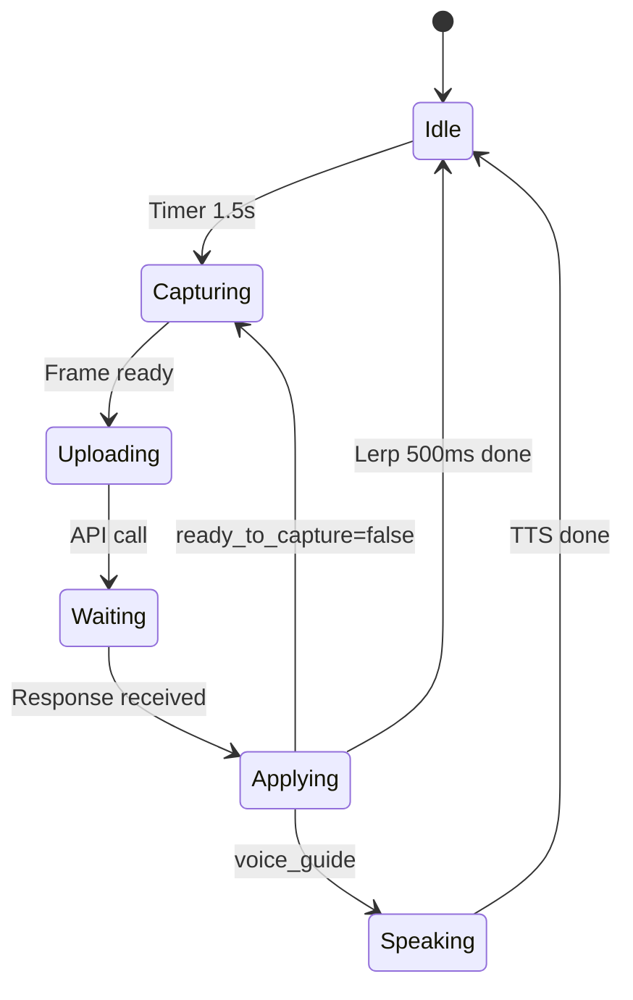

# AI 摄影指导应用 - 开发计划

## 现状与差异分析

| 架构需求    | 当前实现                                      | 待补齐                             |
| ----------- | --------------------------------------------- | ---------------------------------- |
| Shader 参数 | brightness, saturation, contrast, tint(R,G,B) | 新增 warmth, vignette              |
| 参数来源    | 手动 Slider                                   | AI 返回 JSON，Lerp 插值            |
| 抽帧        | 无                                            | startImageStream + YUV→JPEG Base64 |
| 意图输入    | 无                                            | 启动前输入「赛博朋克雨夜街景」等   |
| 语音指导    | 无                                            | TTS 播放 AI 返回的 15 字指导       |
| 后端        | 无                                            | FastAPI 中继 + 多 LLM 配置         |

------

## Phase 1: 可行性验证 (1-2 天)

### 1.1 多模态 API 延迟测试

- 搭建最简 FastAPI：单端点 `/analyze` 接收 Base64 图片 + `intent` 文本，转发 Gemini 1.5 Pro / GPT-4o
- 使用 Postman 或 curl 传 640px JPEG（约 30-80KB），记录响应时间
- **目标**：P95 < 2s，否则需压缩到 480px 或换更轻量模型

### 1.2 抽帧链路验证

- 在 [camera_filter_page.dart](lib/pages/camera_filter_page.dart) 内启用 `startImageStream`
- 使用 `ImageFormatGroup.bgra8888` 或 `yuv_to_png` 将 CameraImage 转为 JPEG
- 用 `image` 包缩放到 640 宽，再 `base64Encode`
- **验证**：能否在预览不卡顿的前提下，每 1.5s 产出一张 Base64（注意与 `CameraPreview` 共享 controller 时不能同时用 `takePicture`，但 `startImageStream` 可与 `CameraPreview` 共存）

### 1.3 Shader 平滑过渡验证

- 已通过 Slider 验证参数实时响应
- 新增：`AnimationController` + `Tween<double>`，500ms 内从旧值 Lerp 到新值，驱动 Shader 参数
- **目标**：过渡无掉帧，FPS 保持稳定

------

## Phase 2: Shader 扩展 (0.5 天)

### 2.1 扩展 pro_camera.frag

在 [shaders/pro_camera.frag](shaders/pro_camera.frag) 中新增：

- `float uWarmth` (0.0=冷色, 1.0=中性, 2.0=暖色)：通过调节 tint 或单独公式实现
- `float uVignette` (0.0=无, 1.0=强暗角)：基于 `distance(uv, vec2(0.5))` 的径向衰减

Uniform 顺序需与 Dart 侧 `setFloat` 索引一致，当前为：

```
2:brightness, 3:saturation, 4:contrast, 5:tintR, 6:tintG, 7:tintB
→ 新增 8:warmth, 9:vignette
```

### 2.2 统一 Shader 参数模型

在 Flutter 中定义 `ShaderParams` 数据类，包含 8 个字段，便于 AI JSON 解析与 Lerp 插值：

```dart
class ShaderParams {
  final double brightness, saturation, contrast;
  final double tintR, tintG, tintB;
  final double warmth, vignette;
}
```

------

## Phase 3: 后端 API (1-2 天)

### 3.1 项目结构

```
backend/
├── main.py           # FastAPI app
├── config.py         # API keys, LLM provider 配置
├── prompts/
│   └── photo_director.py   # 摄影专家 Prompt 模板
├── providers/
│   ├── base.py       # 抽象接口
│   ├── gemini.py     # Gemini 1.5 Pro
│   └── openai.py     # GPT-4o
└── requirements.txt
```

### 3.2 API 契约

**POST /api/analyze**

Request:

```json
{
  "image_base64": "data:image/jpeg;base64,...",
  "intent": "赛博朋克风格的雨夜街景"
}
```

Response (严格 JSON):

```json
{
  "analysis": {
    "light_direction": "顶光，有路灯散射",
    "subject_mood": "街道冷清",
    "composition_tip": "建议将路灯置于画面左侧三分之一"
  },
  "shader": {
    "brightness": -0.1,
    "saturation": 1.2,
    "contrast": 1.1,
    "tintR": 0.9,
    "tintG": 0.95,
    "tintB": 1.2,
    "warmth": 0.6,
    "vignette": 0.4 
  },
  "voice_guide": "镜头往左移一点，避开路灯",
  "ready_to_capture": false
}
```

### 3.3 摄影专家 Prompt 策略

- 使用结构化 Prompt，明确要求返回 JSON
- 分析层：光线、主体情绪、构图建议（各 1-2 句）
- 执行层：8 个 Shader 参数，给出数值范围约束
- 导演层：`voice_guide` 15 字以内，口语化
- `ready_to_capture`: 当构图、光线、色彩均达标时设为 true

### 3.4 多 LLM 配置

- 环境变量 `LLM_PROVIDER=gemini|openai`
- 环境变量 `GEMINI_API_KEY` / `OPENAI_API_KEY`
- `providers/base.py` 定义 `analyze(image_b64, intent) -> dict`

------

## Phase 4: Flutter 端 Director Loop (2 天)

### 4.1 抽帧服务

在 `lib/services/` 下新增 `FrameCaptureService`：

- 使用 `Timer.periodic(Duration(milliseconds: 1500), ...)` 触发抽帧
- 从 `startImageStream` 获取最新 CameraImage（可用 `Stream` + `broadcast`，或轮询最新帧）
- YUV→JPEG：`yuv_to_png` 或 `image` 包，缩放到 640 宽
- 输出：`Future<Uint8List> captureFrame()` 或 `Stream<Uint8List>`

注意：`startImageStream` 与 `CameraPreview` 共享 controller，需确认 camera 插件是否支持「同时预览 + 取流」。若不支持，可考虑双 controller（一个预览，一个仅取流，部分设备可行）或降级为 `takePicture` 定时拍照（会有闪一下的风险）。

### 4.2 意图输入入口

- 在主入口或进入相机页前，增加「输入拍摄意图」对话框/页面
- 示例：「赛博朋克雨夜街景」「逆光人像」「美食特写」
- 将 `intent` 传入 `AIDirectorPage`（或重命名后的相机页）

### 4.3 AI 分析客户端

`lib/services/ai_director_client.dart`：

- `Future<DirectorResponse> analyze(String imageBase64, String intent)`
- 使用 `http` 或 `dio` 调用 `POST $baseUrl/api/analyze`
- 解析 JSON 为 `DirectorResponse`（含 analysis, shader, voice_guide, ready_to_capture）

### 4.4 Director Loop 主逻辑

在 `AIDirectorPage` 中：



- 抽帧 → 上传 → 解析 JSON → 更新 `targetShaderParams`
- `AnimationController` 驱动 `currentShaderParams` 从当前值 Lerp 到 `targetShaderParams`（500ms）
- 若 `voice_guide` 非空，调用 TTS 播放
- 若 `ready_to_capture == true`，可自动触发「完美，保持，正在拍摄」语音 + 延迟 500ms 后自动拍照（可选）

### 4.5 参数平滑过渡

- 使用 `TickerProviderStateMixin` + `AnimationController(duration: 500ms)`
- 每收到新 `targetShaderParams`，启动 Animation，在 `addListener` 中按 `animation.value` 对 8 个参数做 Lerp
- 将 `currentShaderParams` 传给 `_buildShaderOverlay`

------

## Phase 5: 语音交互 (0.5-1 天)

### 5.1 TTS 集成

- 使用 `flutter_tts` 调用系统 TTS（无额外 API 成本）
- 或集成 OpenAI TTS API（音质更好，需后端转发）

### 5.2 触发逻辑

- 收到 `voice_guide` 后立即排队播放
- 若上一条正在播放，可中断或排队（建议排队，避免频繁打断）
- `ready_to_capture` 时播放预设语音：「完美，保持，正在拍摄」

------

## Phase 6: 拍照与后置处理 (可选，1 天)

### 6.1 高清拍照

- 用户点击快门或 AI 自动触发时，调用 `controller.takePicture()`
- 保存到临时路径，可传入「后置处理」流程

### 6.2 可选：AI 精修

- 将原图 Base64 传给后端新端点 `/api/refine`
- 调用 Vision 模型做局部重绘或调色建议
- 返回处理后的 Base64，写入相册（需 `image_gallery_saver` 或 `photo_manager`）

------

## 依赖清单

### Flutter (pubspec.yaml)

- `camera`（已有）
- `yuv_to_png` 或 `image`（YUV→JPEG + 缩放）
- `http` 或 `dio`（API 调用）
- `flutter_tts`（TTS）

### Backend (requirements.txt)

- `fastapi`, `uvicorn`
- `google-generativeai`（Gemini）
- `openai`（GPT-4o）
- `python-multipart`（接收 Base64）
- `pydantic`（请求/响应模型）

------

## 风险与缓解

| 风险                                   | 缓解                                                         |
| -------------------------------------- | ------------------------------------------------------------ |
| startImageStream 与 CameraPreview 冲突 | 查 camera 插件文档；若不支持，改用定时 `takePicture` 或降帧率 |
| API 延迟 > 2s                          | 压缩到 480px；考虑 Gemini Flash 等轻量模型                   |
| LLM 返回非合法 JSON                    | Prompt 强调「仅返回 JSON」；后端加 retry + 正则提取          |
| Shader 参数超出范围                    | 在解析后 clamp 到定义区间                                    |

------

## 建议实施顺序

1. Phase 1 可行性验证（抽帧、API 延迟、Lerp）
2. Phase 2 Shader 扩展（warmth, vignette）
3. Phase 3 后端 API（FastAPI + Prompt + 多 LLM）
4. Phase 4 Director Loop（抽帧服务、AI 客户端、主逻辑、Lerp）
5. Phase 5 TTS
6. Phase 6 拍照与后置（按需）